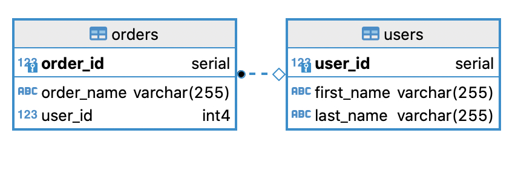

# SQL

## Tables

### Users

| Field        | Type    | Description                                   |
| ------------ | ------- | --------------------------------------------- |
| `user_id`    | int     | Primary Key and Unique identifier of the user |
| `first_name` | varchar | user First Name                               |
| `last_name`  | varchar | User Last Name                                |

### Orders

| Field        | Type    | Description                                    |
| ------------ | ------- | ---------------------------------------------- |
| `order_id`   | int     | Primary Key and Unique identifier of the order |
| `first_name` | varchar | Order name                                     |
| `last_name`  | varchar | User who submitted order                       |

## Diagram



## Task

Give us pseudo code or talk through the following:

### Fix this sql

```sql
select * from 

```

- Broken join
- Query table selecting c1, c2, c3
- add filter to only active one
- add filter where name is like Bob
- Join two tables
- create a table
